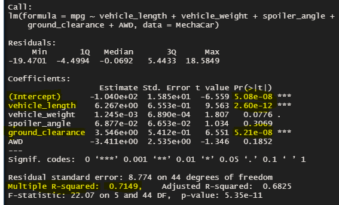

# MechaCar_Statistical_Analysis
R and its statistical test capabilities

## Background
A few weeks after starting his new role, Jeremy is approached by upper management about a special project. AutosRUs’ newest prototype, the MechaCar, is suffering from production troubles that are blocking the manufacturing team’s progress. AutosRUs’ upper management has called on Jeremy and the data analytics team to review the production data for insights that may help the manufacturing team.

1. Deliverable 1: Linear Regression to Predict MPG
    Preform multiple linear regression analysis to identify which variables in the data set predict the mpg of MechaCar prototypes

    

2. Deiverable 2: Summary Statistics on Suspension Coils
    Collect summary statistics on the pounds per square inch (PSI) of the suspension coils from the manufacturing lots

3. Deliverable 3: T-Test on Suspension Coils
    Run t-tests to determine if the manufacturing lots are statistically different from the mean population

4. Deliverable 4: Design a Study Comparing the MechaCar to the Competition
    Design a statistical study to compare vehicle performance of the MechaCar vehicles against vehicles from other manufacturers. For each statistical analysis, you'll write a summary interpretation of the findings.

